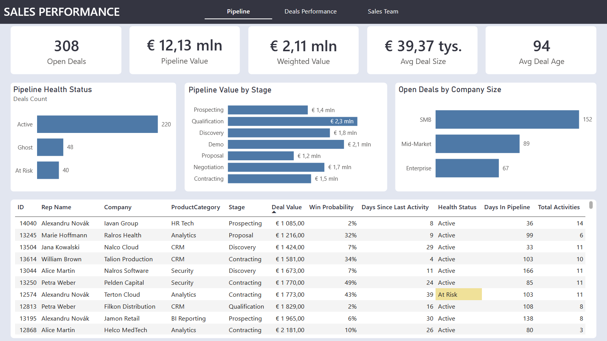
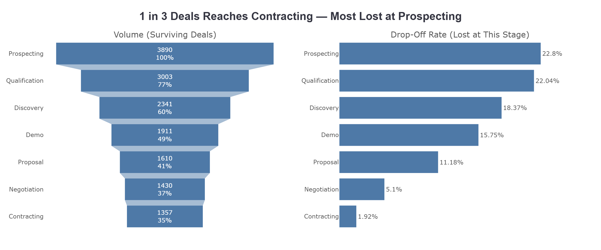
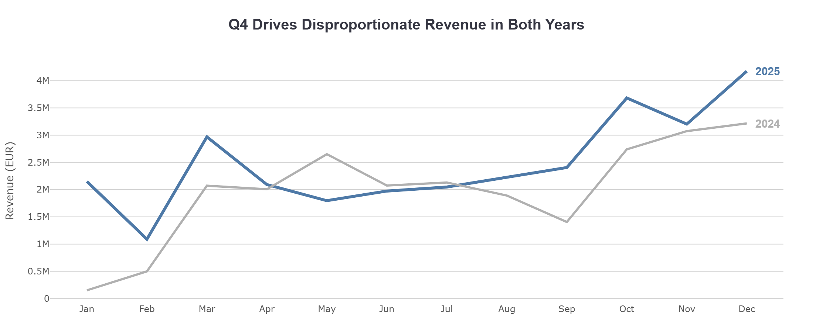
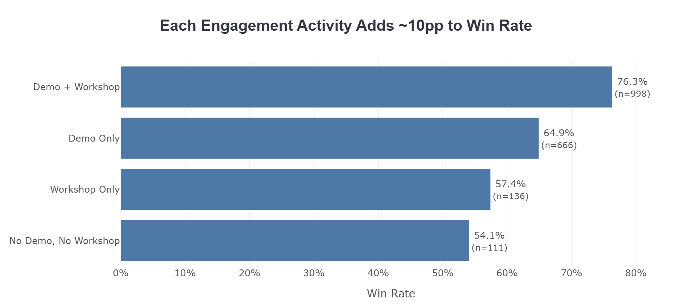
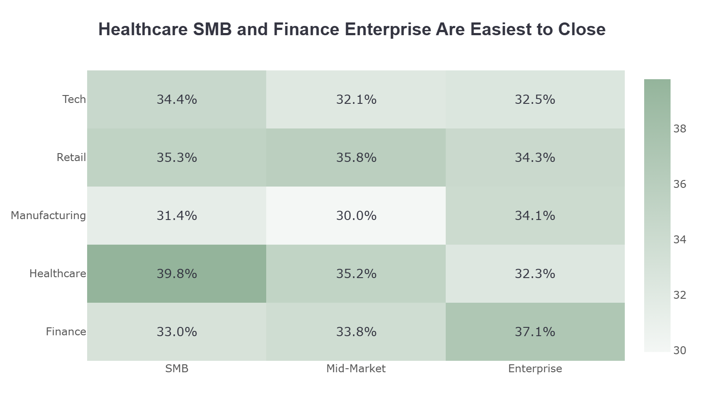
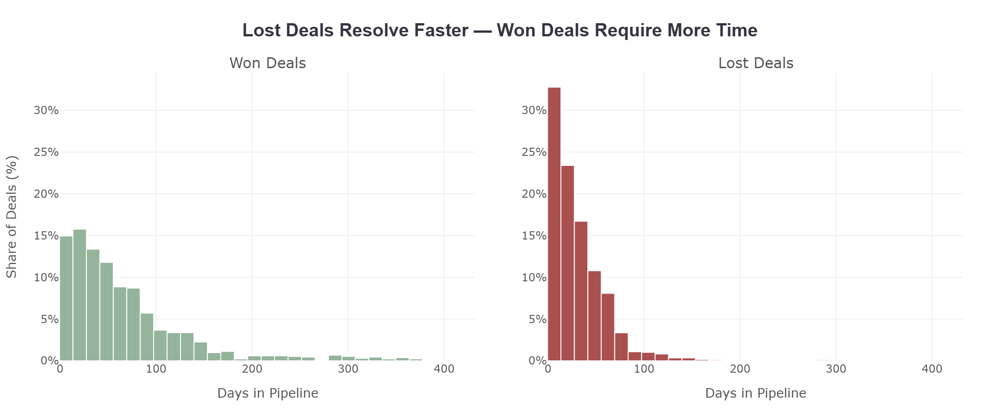

<h1 align='center'>B2B Sales Pipeline Analysis</h1>

<div>

* [Introduction](#introduction)
* [Dashboard](#dashboard)
* [Deep Dive Analysis](#deep-dive)
* [Recommendations](#recommendations)
* [Technical Details](#technical-details)

</div>

<h2 align='center' id='introduction'>Introduction</h2>

### Project Overview

This project analyzes a B2B SaaS sales performance for a fictional European software company, utilizing a fully synthetic dataset of ~4,200 deals and 40,000+ activities spanning 2024–2026. The analysis evaluates pipeline health, sales team performance, and engagement metrics to identify bottlenecks, define the Ideal Customer Profile (ICP), and uncover actionable insights that increase Win Rates. It demonstrates an end-to-end analytics workflow - from SQL-based data transformation to interactive Power BI dashboarding and deep-dive Python EDA.


### Key Metrics
| Metric | Definition | Business Purpose |
|:---|:---|:---|
| **Win Rate** | Won deals / (Won + Lost deals) | Measures sales team effectiveness at closing opportunities |
| **Pipeline Value** | Sum of DealValueEUR for Open deals | Indicates total revenue potential currently in progress |
| **Weighted Pipeline Value** | Pipeline Value × AdjustedWinProbability | Realistic revenue forecast accounting for deal quality |
| **Avg Deal Size** | Mean DealValueEUR for Won deals | Tracks deal complexity and target customer segment |
| **Avg Sales Cycle** | Mean DaysInPipeline for Won deals | Measures efficiency of the sales process |
| **Avg Deal Age** | Mean DaysInPipeline for Open deals | Identifies stagnation risk in active pipeline |
| **Deal Health Status** | Active / At Risk / Ghost based on days since last activity | Flags pipeline quality and rep engagement issues |
| **Drop-Off Rate** | Lost deals at stage / deals entered stage | Pinpoints where pipeline leakage occurs in the funnel |
| **Activity Impact** | Win rate by activity type combination | Quantifies which sales activities drive deal outcomes |


<h2 align='center' id='dashboard'>Dashboard</h2>
<div align=center>
<a href='https://app.powerbi.com/view?r=eyJrIjoiYmE2NDcwMzYtYjRhMy00NTc4LTg5YzgtNjQzZDY3MjcxNTg5IiwidCI6ImRmODY3OWNkLWE4MGUtNDVkOC05OWFjLWM4M2VkN2ZmOTVhMCJ9&pageName=a32bac66360096a2b48c'>

</a>

<a href='https://app.powerbi.com/view?r=eyJrIjoiYmE2NDcwMzYtYjRhMy00NTc4LTg5YzgtNjQzZDY3MjcxNTg5IiwidCI6ImRmODY3OWNkLWE4MGUtNDVkOC05OWFjLWM4M2VkN2ZmOTVhMCJ9&pageName=a32bac66360096a2b48c'>View Interactive Power BI Dashboard</a>
</div>


<h2 align='center' id='executive-summary'>Executive Summary</h2>

### Key Findings

* **The sales funnel loses most deals early:** Nearly half of all lost opportunities drop off at Prospecting or Qualification, before any meaningful engagement takes place.

* **Product Demos Drive Deal Closures:** Engaging clients with both a Demo and a Workshop yields a massive 76.3% Win Rate. Interestingly, conducting a Workshop 
without a prior Demo (57.4%) is nearly as ineffective as doing neither (54.1%). 

* **Win rate and deal size scale consistently with seniority:** Junior reps close at 25% with €28K avg deal size, Mid at 31% with €29K, and Senior at 43% with €67K. Senior reps drive disproportionate revenue despite being the smallest group - closing deals more than twice as large as their Junior and Mid counterparts.


<h2 align='center' id='deep-dive'>Deep Dive Analysis</h2>

### 1. Sales Pipeline Funnel

<div align='center'>

</div>

While the late-stage pipeline is highly efficient (only a 1.92% drop-off at Contracting), the top-of-funnel metrics reveal a significant bottleneck. Nearly 45% of all generated opportunities are discarded in the Prospecting (22.8%) and Qualification (22.04%) stages.

This massive early attrition suggests a severe misalignment between Marketing lead generation and Sales criteria. The sales team is spending too much time filtering out unqualified leads (e.g., prospects with no budget, wrong ICP fit, or lack of authority) before any meaningful product demonstration can occur.

### 2. Revenue Seasonality

<div align='center'>

</div>

Q4 consistently drives the highest revenue in both 2024 and 2025, with December as the peak month in each year. The mid-year period (June–August) shows a visible slowdown consistent with summer holiday cycles. 2025 outperformed 2024 from September onward, with the gap widening significantly in Q4. The sharp drop in January 2024 reflects the dataset starting point rather than an actual business decline.

### 3. Activity Impact on Win Rate

<div align='center'>

</div>

>**Note:** Analysis is limited to deals that reached Stage 4 (Demo) or beyond, to avoid comparing deals with fundamentally different sales journeys.

This chart proves that hands-on client engagement compounds success. A baseline deal with no demo or workshop closes at 54.1%. Adding a product Demo boosts this to 64.9%. However, the ultimate conversion driver is combining both a Demo and a Workshop, which skyrockets the Win Rate to 76.3% across a massive sample size (n=998). Interestingly, running a Workshop without a prior Demo (57.4%) is an inefficient use of technical resources.

### 4. Ideal Customer Profile

<div align='center'>

</div>

The heatmap identifies clear "sweet spots" for customer acquisition. Healthcare SMBs (39.8%) and Enterprise Finance (37.1%) yield the highest Win Rates, making them the most profitable targets. On the other end of the spectrum, Mid-Market Manufacturing struggles to convert at just 30.0%. Marketing and outbound SDR efforts should be heavily skewed toward small medical entities and large financial institutions to maximize ROI.

### 5. Time in Pipeline

<div align='center'>

</div>

Lost deals are resolved quickly - over 80% are closed within 60 days, reflecting early-stage disqualification. Won deals show a much wider distribution, with a long tail extending beyond 200 days, driven by complex Enterprise opportunities that require longer sales cycles. The median won deal takes roughly 40 days to close, but the spread is considerably larger than for lost deals, highlighting the variability in Enterprise deal complexity.


<h2 align='center' id='recommendations'>Recommendations</h2>

### 1. Fix the Funnel at the Top, Not the Bottom
Nearly half of all lost deals drop off at Prospecting and Qualification — before any meaningful sales activity takes place. Rather than investing in closing training for AEs, the priority should be improving lead qualification criteria. Stricter entry criteria for the pipeline would reduce wasted effort and improve overall conversion rates downstream.

### 2. "Demo-First, Workshop-Second" Motion
Standardize the late-stage sales playbook. Forbid technical workshops from being scheduled unless a product Demo has already been completed.

### 3. Bridge the Seniority Gap through Mentorship & Pairing
Given that Senior reps close deals at nearly double the rate (43% vs 25%) and at more than double the average deal size (€67K vs €28K) compared to Juniors, establish a formal pairing program.

### 4. Implement a CRM "Auto-Close" Policy
16% of open deals have had no activity for 60+ days, representing €1.8M in stagnant pipeline. These deals are unlikely to close without intervention and are distorting pipeline forecasts. Institute a rule that automatically moves deals to "Lost" if they are in early stages with no activity for 60+ days.


<h2 align='center' id='technical-details'>Technical Details</h2>

### Tech Stack

| Layer | Tool | Purpose |
|:---|:---|:---|
| Database | Microsoft SQL Server | Data storage, transformation and SQL views |
| Dashboarding | Microsoft Power BI | Interactive sales performance dashboard |
| Analysis | Python (Jupyter Notebook) | Exploratory data analysis and visualisation |

### Data Model

The dataset follows a star schema with two fact tables and three dimension tables.
```
DimDate ──────────┐
DimCompany ───────┤── FactDeals ──── FactActivities
DimSalesRep ──────┘
```

| Table | Rows | Description |
|:---|:---|:---|
| FactDeals | ~4,200 | One row per deal with stage, status, value and dates |
| FactActivities | ~41,000 | One row per sales activity linked to a deal |
| DimSalesRep | 55 | Sales representatives with role, seniority and region |
| DimCompany | 1,000 | Client companies with size, industry and country |
| DimDate | 790 | Date dimension with workday and holiday flags |


### SQL Views

Two views were created on top of the raw tables:

**v_DealsEnriched** — extends FactDeals with aggregated activity counts per deal, deal health status (Active / At Risk / Ghost) based on days since last activity, weighted deal value, and derived categories used in Power BI.

**v_OBT** — One Big Table joining all five tables into a single flat structure for Python EDA. Removes technical keys and adds human-readable fields such as CreatedDate, TenureYears and derived date parts.


### Dataset Notes

- Data covers the period January 2024 - February 2026, with February 28, 2026 used as the reference "today" date
- All monetary values are in **EUR**
- The dataset is fully synthetic and was generated to reflect realistic B2B SaaS sales patterns including seasonal trends, seniority-based win rates, and stage-appropriate activity distributions
- A small number of deals with anomalous activity patterns (Active status, 80+ days in pipeline, fewer than 5 activities, no meetings or demos) were removed during data cleaning as likely data quality issues
- 2026 data covers January and February only — year-level comparisons in the analysis are based on 2024 and 2025 full years